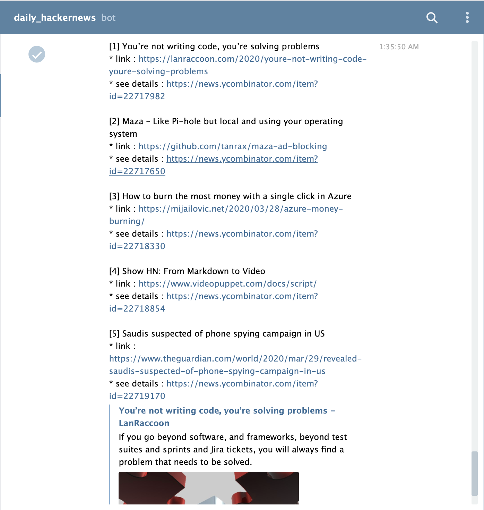

# Daily HackerNews Action

Let's get [top Hackernews](https://news.ycombinator.com/) everyday via Telegram.

## Usage

As getting a daily top hacker news through Telegram.

```
name: Daily HackerNews
on:
  schedule:
  - cron: 0 12 * * *  # Every day at noon

jobs:
  daily_hackernews:
    name: Daily HackerNews
    runs-on: ubuntu-latest
    steps:

    - name: daily-hackernews
      uses: actions/checkout@v1.0
      with:
        chat_id: "Telegram chat id"
        coount: 5
      env:
        TELEGRAM_KEY: ${{ secrets.TELEGRAM_KEY }}
```

### In action :



## Inputs

- `chat_id`: Chat id with your bot. You can check chat ids which are connected with the bot at here : [https://api.telegram.org/bot{bot_token}/getUpdates](https://api.telegram.org/bot{bot_token}/getUpdates)
- `count`: How many top Hackernews stories you want to get daily. (default: 5)
- `telegram_key` : Telegram bot token to access [Telegram API](https://core.telegram.org/api).

## License

[MIT](https://choosealicense.com/licenses/mit/)
